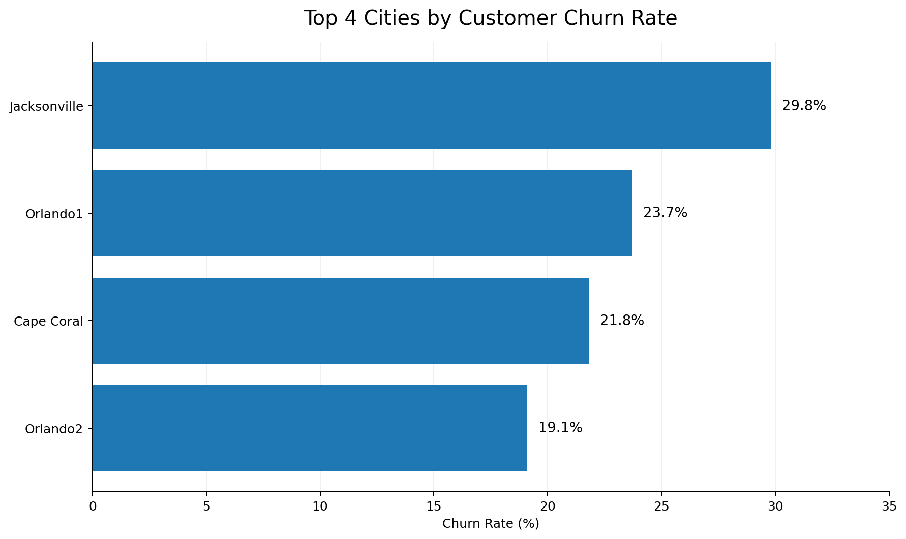

# Telecom Customer Churn Analysis

## Identifying High-Risk Customers and Retention Opportunities

A data analytics project using Python, SQL, exploratory data analysis, and logistic regression to identify the factors associated with customer churn and translate the findings into actionable customer-retention strategies.
## Executive Summary

This project analysed telecommunications customer data to identify where and why customers were most likely to churn.

The analysis identified several actionable risk signals:

- **29.8% churn** in Jacksonville, the highest-churn location
- **42.4% churn** among customers with an international plan
- **More than 3 customer service calls** as a warning signal for increased churn
- **35% predicted churn probability** used as an early-intervention threshold

The findings were translated into a targeted retention strategy combining geographic campaigns, customer-service escalation and predictive customer-risk identification.
## Business Problem

Teleconfia, a telecommunications company expanding into the US market, experienced customer churn during a trial period in Florida.

The company wanted to use its customer data to answer two key business questions:

1. Which cities have the highest customer churn rates and should be targeted with local marketing campaigns?
2. Which individual customers show signs of being at risk of leaving and should be targeted with retention offers?

The objective of this analysis was to identify the strongest indicators of churn, determine useful risk thresholds, and turn the findings into actionable recommendations for the marketing and customer-retention teams.
## Tools & Skills

- **Python** — data cleaning, analysis, customer segmentation and predictive modelling
- **pandas** — data manipulation and preparation
- **SQL / SQLite** — extracting and combining customer and city data
- **Matplotlib & Seaborn** — exploratory analysis and data visualisation
- **Logistic Regression** — estimating customer churn probability
- **Business Analysis** — translating analytical findings into customer-retention recommendations
## Key Findings

### 1. Geographic Churn Risk

The analysis identified four cities with the highest customer churn rates:

| City | Churn Rate |
|---|---:|
| Jacksonville | 29.8% |
| Orlando1 | 23.7% |
| Cape Coral | 21.8% |
| Orlando2 | 19.1% |

**Business implication:** These locations represent priority areas for geographically targeted customer-retention and marketing campaigns.

### 2. International Plan Customers Showed Much Higher Churn

Customers with an international plan had a substantially higher churn rate than customers without one.

| International Plan | Churn Rate |
|---|---:|
| No | 11.5% |
| Yes | 42.4% |

Customers with an international plan therefore showed a churn rate more than three times higher than customers without one.

**Business implication:** Active customers with an international plan represent an important group for targeted retention efforts. The company should also investigate whether pricing, service quality or the structure of the international plan is contributing to customer dissatisfaction.
### 2. International Plan Customers Showed Much Higher Churn

Customers with an international plan had a substantially higher churn rate than customers without one.

| International Plan | Churn Rate |
|---|---:|
| No | 11.5% |
| Yes | 42.4% |

Customers with an international plan therefore showed a churn rate more than three times higher than customers without one.

**Business implication:** Active customers with an international plan represent an important group for targeted retention efforts. The company should also investigate whether pricing, service quality or the structure of the international plan is contributing to customer dissatisfaction.
### 3. Repeated Customer Service Calls Were a Churn Warning Signal

After comparing the numerical count variables, customer service calls showed the clearest relationship with churn.

Customers making more than three calls to customer service showed substantially higher churn rates.

**Business implication:** Customers who exceed three customer service calls should be flagged for proactive retention support. Repeated contact may indicate unresolved problems or growing customer dissatisfaction.
### 4. Predicting Churn Risk with Logistic Regression

Among the continuous variables analysed, `total_day_charge` showed the clearest separation between customers who churned and those who remained.

A logistic regression model was used to estimate each customer's probability of churn based on their total daytime charges.

A **35% predicted churn probability** was used as an early-intervention threshold to identify higher-risk active customers.

Customers who had already churned were excluded because the retention team can only intervene with customers who are still active.

**Business implication:** Active customers whose predicted churn probability reaches 35% or higher can be prioritised for proactive retention campaigns before they leave.
## Business Recommendations

Based on the analysis, I would recommend a targeted retention strategy focused on four areas:

1. **Prioritise high-churn locations**  
   Focus geographically targeted marketing campaigns on Jacksonville, Orlando1, Cape Coral and Orlando2, which showed the highest churn rates.

2. **Review international-plan customers**  
   Customers with an international plan showed substantially higher churn. The company should investigate the pricing, service quality and customer experience associated with this plan and target active international-plan customers with retention offers.

3. **Create a customer-service escalation trigger**  
   Customers making more than three customer service calls should be flagged for proactive follow-up, as repeated service contact was associated with increased churn.

4. **Use predicted churn probability for early intervention**  
   Customers with a predicted churn probability of 35% or higher should be prioritised for retention campaigns, while customers who have already churned should be excluded from active retention lists.

### Recommended Retention Workflow

`Customer shows risk signal → Customer is flagged → Retention team contacts customer → Targeted offer or support is provided`
